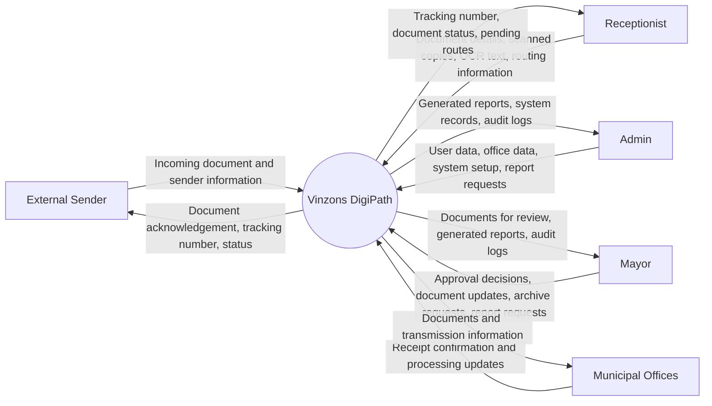
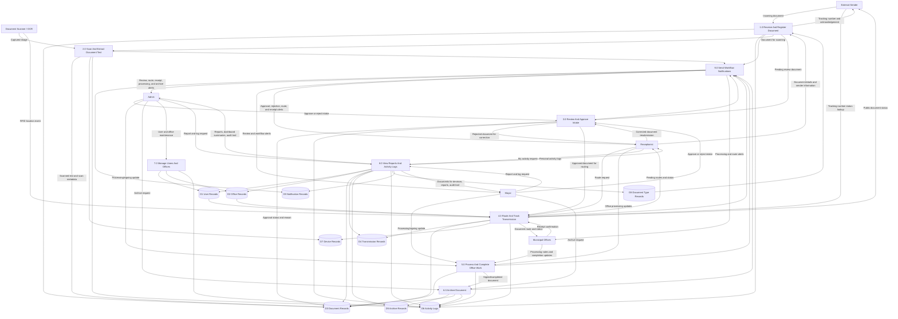

# Updated DFD - Vinzons DigiPath

## Level 0 Context Diagram

```mermaid
flowchart LR
    external["External Sender"]
    receptionist["Receptionist"]
    admin["Admin"]
    mayor["Mayor"]
    office["Municipal Offices"]
    system(("Vinzons DigiPath"))

    external -->|"Incoming document and sender information"| system
    system -->|"Document acknowledgement, tracking number, status"| external

    receptionist -->|"Document details, scanned copies, OCR text, routing information"| system
    system -->|"Tracking number, document status, pending routes"| receptionist

    admin -->|"User data, office data, system setup, report requests"| system
    system -->|"Generated reports, system records, audit logs"| admin

    mayor -->|"Approval decisions, document updates, archive requests, report requests"| system
    system -->|"Documents for review, generated reports, audit logs"| mayor

    office -->|"Receipt confirmation and processing updates"| system
    system -->|"Documents and transmission information"| office
```

## Level 1 Main Processes And Data Stores

```mermaid
flowchart TB
    external["External Sender"]
    receptionist["Receptionist"]
    admin["Admin"]
    mayor["Mayor"]
    officeActor["Municipal Offices"]
    scanner["Document Scanner / OCR"]

    p1["1.0 Receive And Register Document"]
    p2["2.0 Scan And Extract Document Text"]
    pReview["3.0 Review And Approve Intake"]
    p3["4.0 Route And Track Transmission"]
    pOffice["5.0 Process And Complete Office Work"]
    p4["6.0 Archive Document"]
    p5["7.0 Manage Users And Offices"]
    p6["8.0 View Reports And Activity Logs"]
    pNotify["9.0 Send Workflow Notifications"]

    d1[("D1 User Records")]
    d2[("D2 Office Records")]
    d3[("D3 Document Records")]
    d4[("D4 Transmission Records")]
    d5[("D5 Archive Records")]
    d6[("D6 Activity Logs")]
    d7[("D7 Device Records")]
    d8[("D8 Document Type Records")]
    d9[("D9 Notification Records")]

    external -->|"Incoming document"| p1
    receptionist -->|"Document details and sender information"| p1
    p1 -->|"Tracking number and acknowledgement"| external
    external -->|"Tracking number status lookup"| p3
    p1 --> d3
    p1 --> d6
    p1 --> pNotify
    p1 -->|"Document for scanning"| p2
    p1 -->|"Pending review document"| pReview

    scanner -->|"Captured image"| p2
    p2 -->|"Scanned text and scan metadata"| d3
    p2 --> d7
    p2 --> d6
    p2 --> pNotify

    mayor -->|"Approve or reject intake"| pReview
    admin -->|"Approve or reject intake"| pReview
    pReview -->|"Approval status and reason"| d3
    pReview --> d6
    pReview --> pNotify
    pReview -->|"Rejected document for correction"| receptionist
    receptionist -->|"Corrected document resubmission"| pReview
    pReview -->|"Approved document for routing"| p3

    receptionist -->|"Route request"| p3
    officeActor -->|"Receipt confirmation"| p3
    scanner -->|"RFID location event"| p3
    p3 --> d4
    p3 --> d3
    p3 --> d7
    p3 --> d6
    p3 --> pNotify
    p3 -->|"Document route and status"| officeActor
    p3 -->|"Pending routes and status"| receptionist
    p3 -->|"Public document status"| external

    officeActor -->|"Processing notes and completion updates"| pOffice
    receptionist -->|"Office processing updates"| pOffice
    mayor -->|"Processing/signing update"| pOffice
    admin -->|"Processing/signing update"| pOffice
    pOffice --> d3
    pOffice --> d6
    pOffice --> pNotify
    pOffice -->|"Signed/completed document"| p4

    mayor -->|"Archive request"| p4
    admin -->|"Archive request"| p4
    p4 --> d5
    p4 --> d3
    p4 --> d6
    p4 --> pNotify

    admin -->|"User and office maintenance"| p5
    p5 --> d1
    p5 --> d2
    p5 --> d6

    mayor -->|"Report and log request"| p6
    admin -->|"Report and log request"| p6
    receptionist -->|"My activity request"| p6
    p6 --> d1
    p6 --> d2
    p6 --> d3
    p6 --> d4
    p6 --> d5
    p6 --> d6
    p6 --> d8
    p6 --> d9
    p6 -->|"Reports, dashboard summaries, audit trail"| admin
    p6 -->|"Documents for decision, reports, audit trail"| mayor
    p6 -->|"Personal activity logs"| receptionist

    pNotify --> d9
    pNotify -->|"Review, route, receipt, processing, and archive alerts"| admin
    pNotify -->|"Review and workflow alerts"| mayor
    pNotify -->|"Approval, rejection, route, and receipt alerts"| receptionist
    pNotify -->|"Processing and route alerts"| officeActor

    d8 --> p1
    d1 --> p3
    d2 --> p3
```

