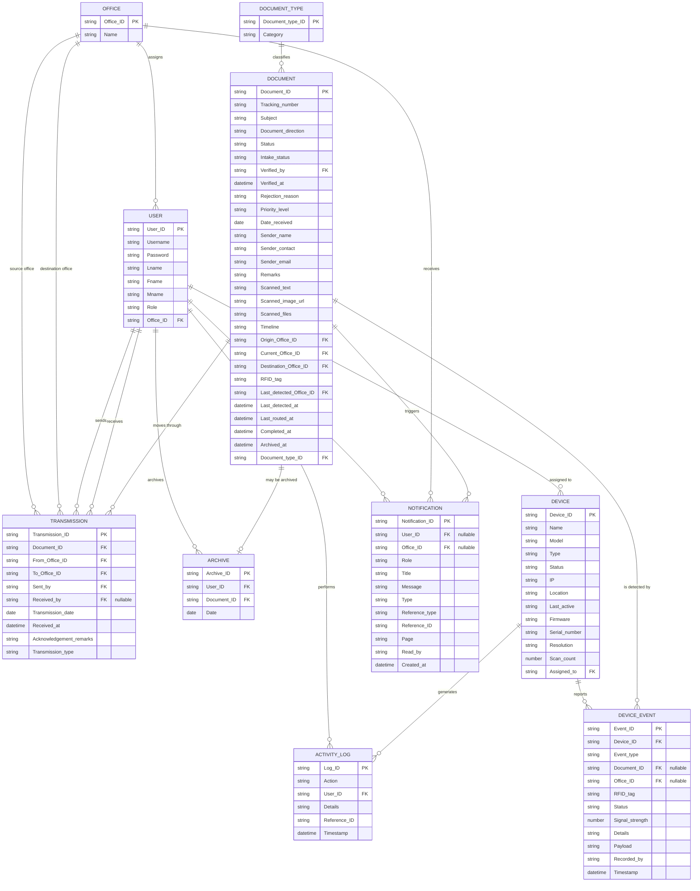

# Updated ERD - Vinzons DigiPath

```mermaid
erDiagram
    OFFICE ||--o{ USER : "assigns"
    OFFICE ||--o{ TRANSMISSION : "source office"
    OFFICE ||--o{ TRANSMISSION : "destination office"

    USER ||--o{ TRANSMISSION : "sends"
    USER ||--o{ TRANSMISSION : "receives"
    USER ||--o{ ARCHIVE : "archives"
    USER ||--o{ ACTIVITY_LOG : "performs"
    USER ||--o{ DEVICE : "assigned to"
    USER ||--o{ NOTIFICATION : "receives"
    OFFICE ||--o{ NOTIFICATION : "receives"

    DOCUMENT_TYPE ||--o{ DOCUMENT : "classifies"
    DOCUMENT ||--o{ TRANSMISSION : "moves through"
    DOCUMENT ||--o| ARCHIVE : "may be archived"
    DOCUMENT ||--o{ NOTIFICATION : "triggers"

    DEVICE ||--o{ ACTIVITY_LOG : "generates"
    DEVICE ||--o{ DEVICE_EVENT : "reports"
    DOCUMENT ||--o{ DEVICE_EVENT : "is detected by"

    OFFICE {
        string Office_ID PK
        string Name
    }

    USER {
        string User_ID PK
        string Username
        string Password
        string Lname
        string Fname
        string Mname
        string Role
        string Office_ID FK
    }

    DOCUMENT_TYPE {
        string Document_type_ID PK
        string Category
    }

    DOCUMENT {
        string Document_ID PK
        string Tracking_number
        string Subject
        string Document_direction
        string Status
        string Intake_status
        string Verified_by FK
        datetime Verified_at
        string Rejection_reason
        string Priority_level
        date Date_received
        string Sender_name
        string Sender_contact
        string Sender_email
        string Remarks
        string Scanned_text
        string Scanned_image_url
        string Scanned_files
        string Timeline
        string Origin_Office_ID FK
        string Current_Office_ID FK
        string Destination_Office_ID FK
        string RFID_tag
        string Last_detected_Office_ID FK
        datetime Last_detected_at
        datetime Last_routed_at
        datetime Completed_at
        datetime Archived_at
        string Document_type_ID FK
    }

    TRANSMISSION {
        string Transmission_ID PK
        string Document_ID FK
        string From_Office_ID FK
        string To_Office_ID FK
        string Sent_by FK
        string Received_by FK "nullable"
        date Transmission_date
        datetime Received_at
        string Acknowledgement_remarks
        string Transmission_type
    }

    ARCHIVE {
        string Archive_ID PK
        string User_ID FK
        string Document_ID FK
        date Date
    }

    DEVICE {
        string Device_ID PK
        string Name
        string Model
        string Type
        string Status
        string IP
        string Location
        string Last_active
        string Firmware
        string Serial_number
        string Resolution
        number Scan_count
        string Assigned_to FK
    }

    DEVICE_EVENT {
        string Event_ID PK
        string Device_ID FK
        string Event_type
        string Document_ID FK "nullable"
        string Office_ID FK "nullable"
        string RFID_tag
        string Status
        number Signal_strength
        string Details
        string Payload
        string Recorded_by
        datetime Timestamp
    }

    NOTIFICATION {
        string Notification_ID PK
        string User_ID FK "nullable"
        string Office_ID FK "nullable"
        string Role
        string Title
        string Message
        string Type
        string Reference_type
        string Reference_ID
        string Page
        string Read_by
        datetime Created_at
    }

    ACTIVITY_LOG {
        string Log_ID PK
        string Action
        string User_ID FK
        string Details
        string Reference_ID
        datetime Timestamp
    }
```

